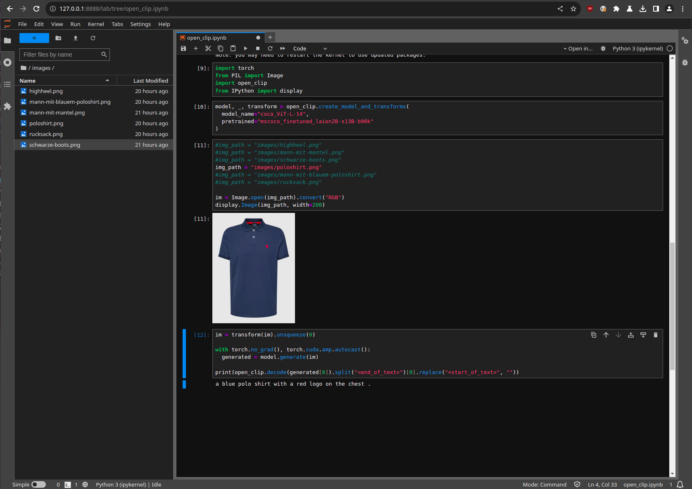

# image llm tests

## Open Clip

https://github.com/mlfoundations/open_clip

    docker-compose -f docker-compose.open-clip.yaml up

Click URL in log-output to open Jupyter notebook

Unfortunately this model is not useful for our case, since the output is limited to a small amount of 
descriptive words.

## Qwen-VL

https://github.com/QwenLM/Qwen-VL

    cd qwen-vl
    git clone git@github.com:QwenLM/Qwen-VL.git

    docker-compose -f docker-compose.qwen-vl-chat.yaml up
